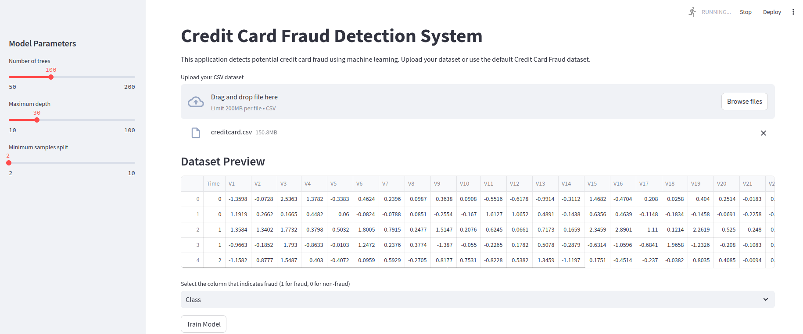

### Credit Card Fraud Detection System

  ## Key Stack:
  - Python (Pandas, numpy, seaborn, matplotlib, sklearn)
  - RandomForestClassifier
  - Streamlit

## Kaggle Dataset link for experimenting: [Link](https://www.kaggle.com/datasets/mlg-ulb/creditcardfraud)
