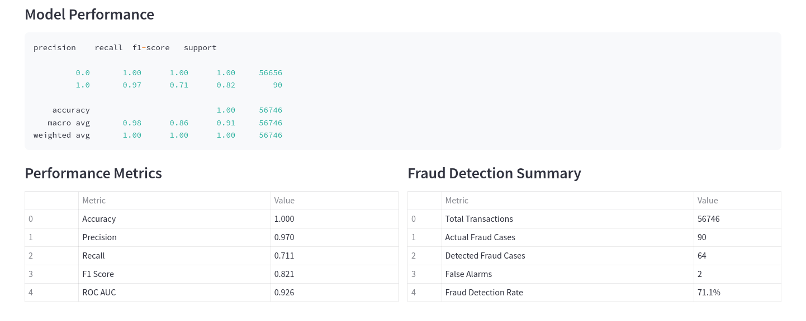
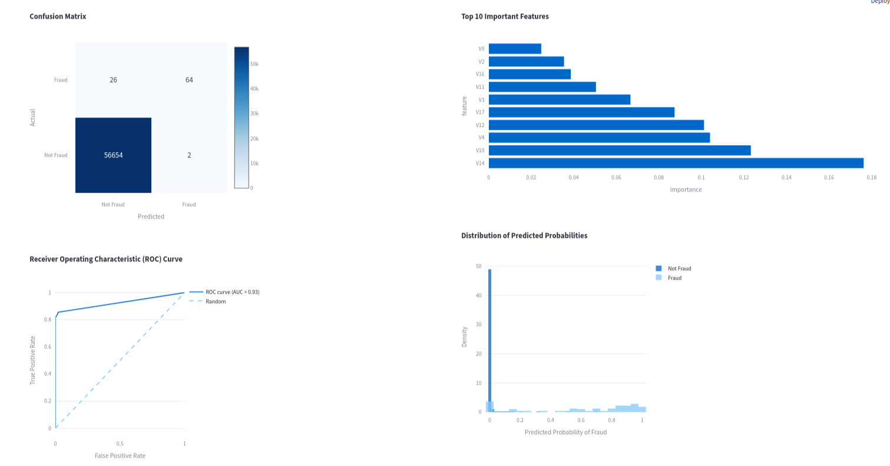

### Credit Card Fraud Detection System

  ## Key Stack:
  - Python (Pandas, Numpy, Seaborn, Matplotlib, Sklearn)
  - Random Forest Classifier
  - Streamlit

## Kaggle Dataset link for experimenting: [Link](https://www.kaggle.com/datasets/mlg-ulb/creditcardfraud)
